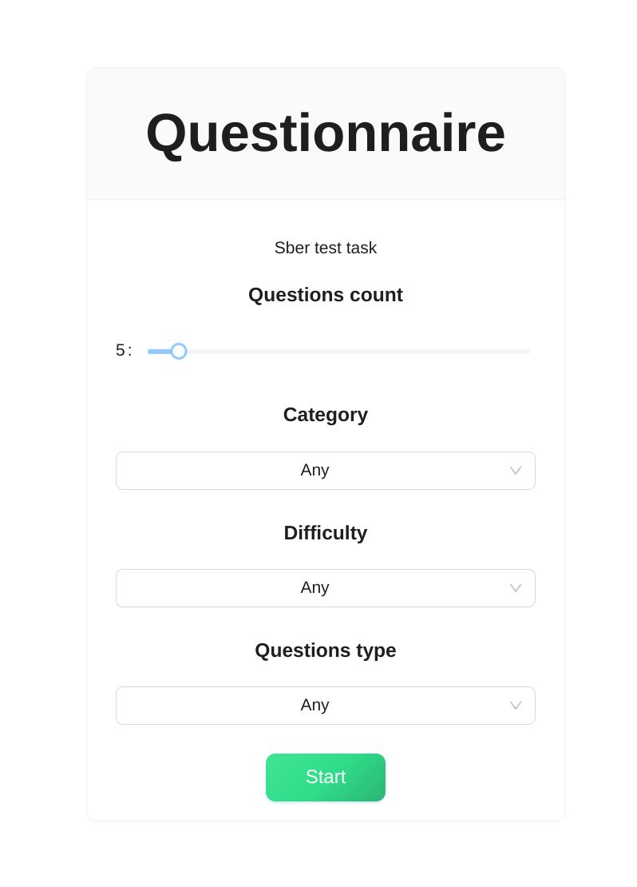
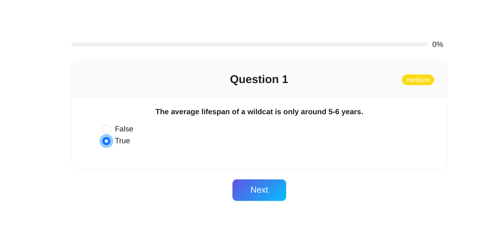
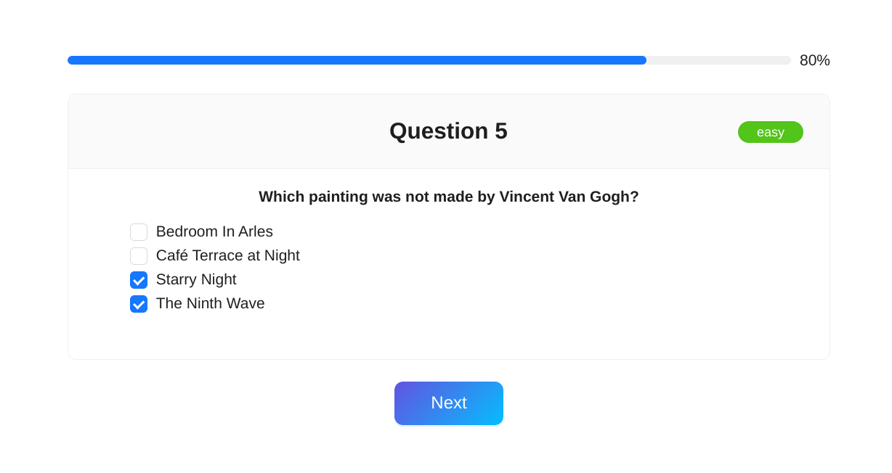
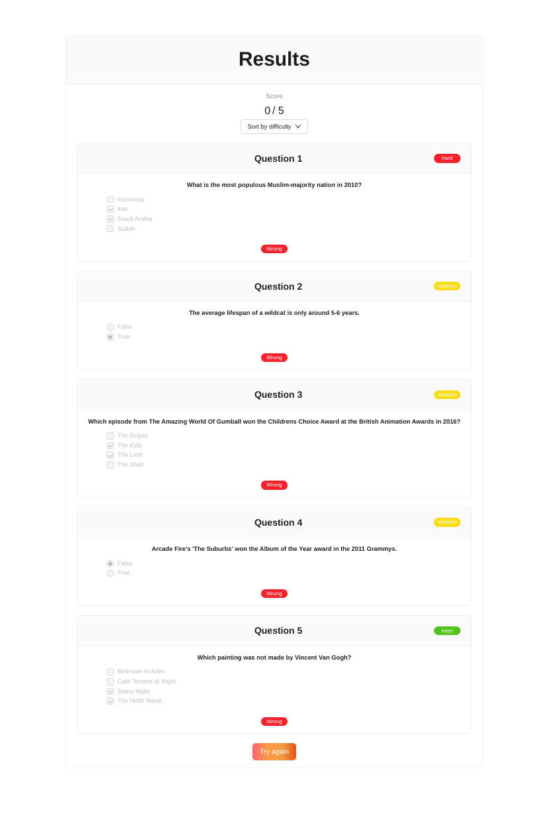

# Сбер - тестовое задание - опросник

Задача: написать реализацию опросника.

Вопросы отображаются по одному, каждый следующий вопрос появляется после ответа на предыдущий.

Правильный вариант ответа может быть один (использовать radio) или несколько (использовать checkbox).
Вопросы обладают атрибутом "сложность" со значениями - easy, medium, hard. На финальном шаге отобразить все результаты используя градацию по уровням сложности (difficulty).


# Демо

Демо доступно по ссылке: [https://justdoitvv.github.io/2024-05_sber_questionnaire/](https://justdoitvv.github.io/2024-05_sber_questionnaire/)






# Запуск проекта - Development

Запуск проекта на этапе разработки, описание переменных окружения, сценариев приведено
 в файле [description.md](description.md).

# Сборка проекта - Stage/Production

```shell
npm run build
```

Далее файлы из папки `dist` поместить на веб-сервер.
